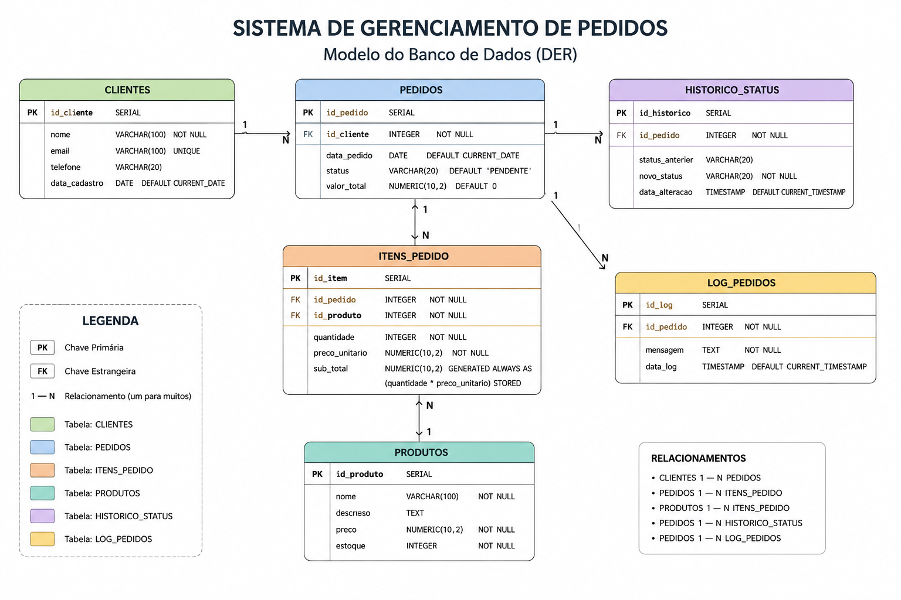
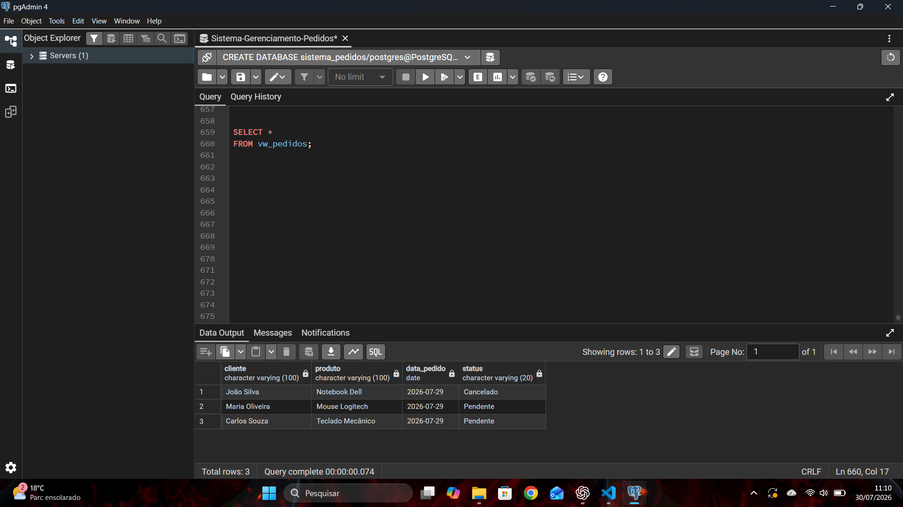
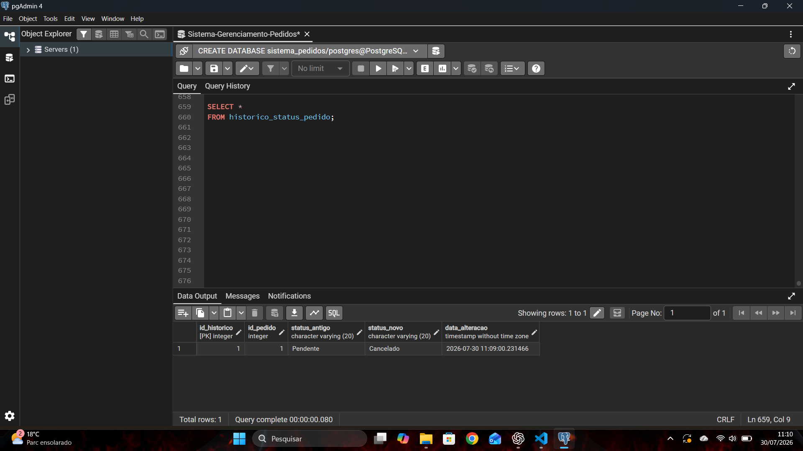

# Sistema de Gerenciamento de Pedidos

projeto utilizando PostgreSQL para praticar modelagem de banco de dados, SQL e PL/pgSQL.

O objetivo deste projeto foi colocar em prática os principais conceitos de banco de dados e desenvolver um sistema de gerenciamento de pedidos para compor meu portfólio.

---

## Tecnologias Utilizadas

- PostgreSQL
- PL/pgSQL
- pgAdmin 4
- Git
- GitHub

---

## Estrutura do Projeto

```text
Sistema-Gerenciamento-Pedidos
│
├── README.md
├── LICENSE
│
├── imagens
│   ├── modelo-banco.png
│   ├── consulta-pedidos.png
│   └── historico-status.png
│
└── sql
    ├── 01_criacao_tabelas.sql
    ├── 02_inserts.sql
    ├── 03_consultas.sql
    ├── 04_views.sql
    ├── 05_indices.sql
    ├── 06_functions.sql
    ├── 07_triggers.sql
    ├── 08_procedures.sql
    └── 09_testes.sql
```

---

## Modelo do Banco de Dados

O sistema é composto pelas seguintes tabelas:

- Clientes
- Produtos
- Pedidos
- Itens do Pedido
- Histórico de Status
- Log de Pedidos

---

## Funcionalidades

- Cadastro de clientes
- Cadastro de produtos
- Criação de pedidos
- Cancelamento de pedidos
- Registro automático de logs
- Histórico de alteração de status
- Consultas utilizando Views
- Otimização de consultas com índices

---

## Conceitos Aplicados

Durante o desenvolvimento deste projeto foram utilizados:

- Criação de tabelas
- Primary Key
- Foreign Key
- INSERT
- UPDATE
- DELETE
- SELECT
- WHERE
- ORDER BY
- LIKE
- INNER JOIN
- LEFT JOIN
- GROUP BY
- HAVING
- Subqueries
- Views
- Índices
- EXPLAIN ANALYZE
- Functions
- Procedures
- Triggers
- Transactions
- Tratamento de exceções

---

## Imagens do Projeto

### Modelo do Banco de Dados

Diagrama das principais tabelas e seus relacionamentos.



---

### Consulta da View de Pedidos

Exemplo de consulta realizada através da view `vw_pedidos`.



---

### Histórico de Alteração de Status

Exemplo do histórico gerado automaticamente pelas triggers após alterações no status dos pedidos.



---

## Como Executar

Execute os arquivos SQL na seguinte ordem:

1. 01_criacao_tabelas.sql
2. 02_inserts.sql
3. 06_functions.sql
4. 07_triggers.sql
5. 04_views.sql
6. 08_procedures.sql
7. 05_indices.sql
8. 03_consultas.sql
9. 09_testes.sql

---

## Objetivo

Este projeto foi desenvolvido para consolidar meus conhecimentos em PostgreSQL, praticar recursos avançados da linguagem SQL e servir como parte do meu portfólio para a área de Banco de Dados.

---

## Autor

**André Campos**

Graduado em Banco de Dados e em constante evolução na área de desenvolvimento e bancos de dados.